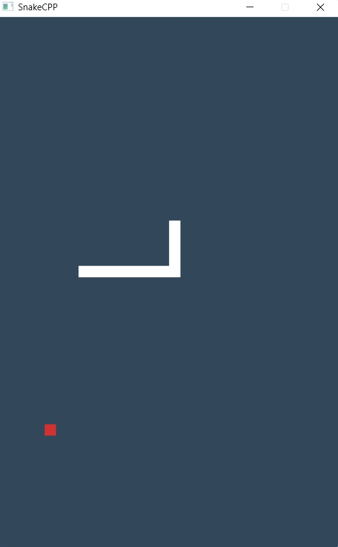

# SnakeCPP

This project is a C++ implementation of the classic Snake game using WinAPI, designed with modularity and object-oriented programming principles in mind. The game consists of various components, including the snake, fruit, game controller, and rendering system, ensuring smooth gameplay and clear separation of concerns.

## Features implemented
* Modular object-oriented design
* User input detection (arrow keys)
* Random fruit generation
* Collision detection
* Snake appears on the opposite side of the window when reaching the border
* Double buffering for smooth rendering
* Animation loop running in a seperate thread so the game doesn't 'freeze' when moving the window
* Unit tests with Google Test

## See also
* **[Compile instructions](docs/index_compile.md)**
* **[Code documentation](docs/index_code.md)**